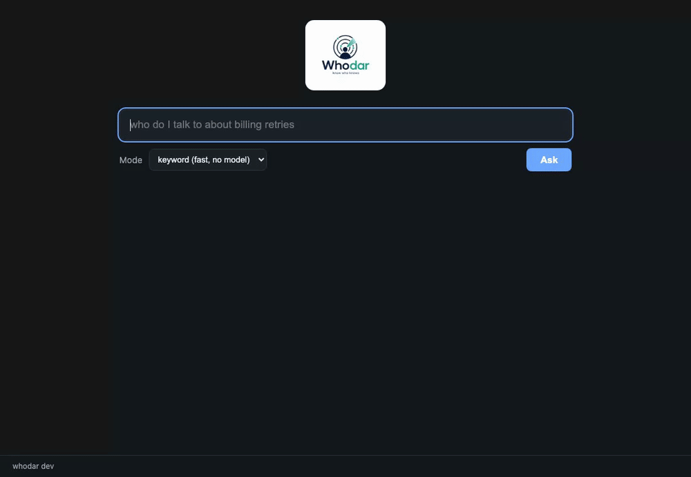

  

# whodar

<em>Know who knows.</em>

  
  
  

Someone at your company already knows the answer. whodar tells you who.
Point it at the tools your org already uses, ask in plain words, and get the
people to talk to and the channels to ask in, each with the reason and
confidence behind it. Local by default, with or without an LLM.

## See it

Ask from the terminal and get people, channels, reasons, and confidence:

  

Or serve the local web UI, where every result carries a confidence badge and
feedback buttons, a query lives in the URL so answers are shareable, clicking
a person shows everything whodar knows about them, and a sidebar browses the
whole graph: people, channels, teams, and topics:

  

## Install

    brew install dcadolph/whodar/whodar

Or `go install github.com/dcadolph/whodar@latest`, or grab a prebuilt binary
from the releases page.

## Quickstart

No data yet? Explore a simulated company across all eight sources, no
credentials needed:

    whodar demo

Then index something real:

    whodar index --source org-csv --file examples/people.csv
    whodar ask --pretty "who do I talk to about billing retries"

Then wire in the rest of your tools. The guided way is `whodar connect`, a wizard
that explains each source, reads the token without echoing it, validates it, and
runs the first index:

    whodar connect

Prefer copy-paste? Every source has a recipe in [docs/CONNECT.md](docs/CONNECT.md),
with the exact credential to create, the command to run, and how to verify it
worked: `slack`, `github`, `jira`, `confluence`, `pagerduty`, `git`, and `codeowners`.

## How it works

| Piece     | What it does                                                                                                    |
| --------- | --------------------------------------------------------------------------------------------------------------- |
| Sources   | Eight pluggable connectors feed one graph of people, teams, topics, and channels. Adding a source is one small interface. |
| Identity  | One human stays one node: sources join by email, and an alias file joins handle-only identifiers like a GitHub login. |
| Ranking   | Owners beat chatterboxes: repetition saturates while explicit signals stay strong. Recency counts, every answer carries a confidence, and results explain which words hit where. |
| Feedback  | Confirm or correct a result and future rankings move, without burying the evidence.                              |
| Modes     | Keyword needs no model and always works; semantic and LLM answers run on local Ollama, or on Claude, Gemini, and OpenAI behind explicit opt-in. |
| Frontends | The CLI, web UI, Slack bot, and an MCP server for agents like Claude Code all share one engine.                   |

## Data governance

Indexed work data is sensitive, so whodar controls what a model can see. The
default policy is strict: answers are computed locally and nothing is sent to
any model beyond this machine. The redacted policy admits only the known
cloud providers (Claude, Gemini, OpenAI) and sends them your question plus numbered
candidates, meaning title, team, and matched query terms, never names,
emails, channel names, or message text. The open policy sends full candidate
detail anywhere you point it. Indexing talks only to the sources you name,
with your own tokens, and the index on disk is readable only by your user.
Serving the web UI beyond localhost requires a bearer token on every request.
An organization can pin the policy with a locked file that user flags and
environment variables cannot override.

## Docs

- [Getting started](docs/GETTING_STARTED.md): install, index each source, ask,
  serve, run the bot.
- [Connect your tools](docs/CONNECT.md): the `whodar connect` wizard plus a
  copy-paste recipe per source, with the exact credential to create for Slack,
  GitHub, Jira, Confluence, and PagerDuty.
- [Reference](docs/REFERENCE.md): every command, flag, source, and
  environment variable.
- [Architecture](docs/ARCHITECTURE.md), [deploying](docs/DEPLOY.md),
  [roadmap](docs/ROADMAP.md), and [contributing](CONTRIBUTING.md).

## License

Licensed under the GNU Affero General Public License v3.0. See [LICENSE](LICENSE).
Copyright 2026 dcadolph.
