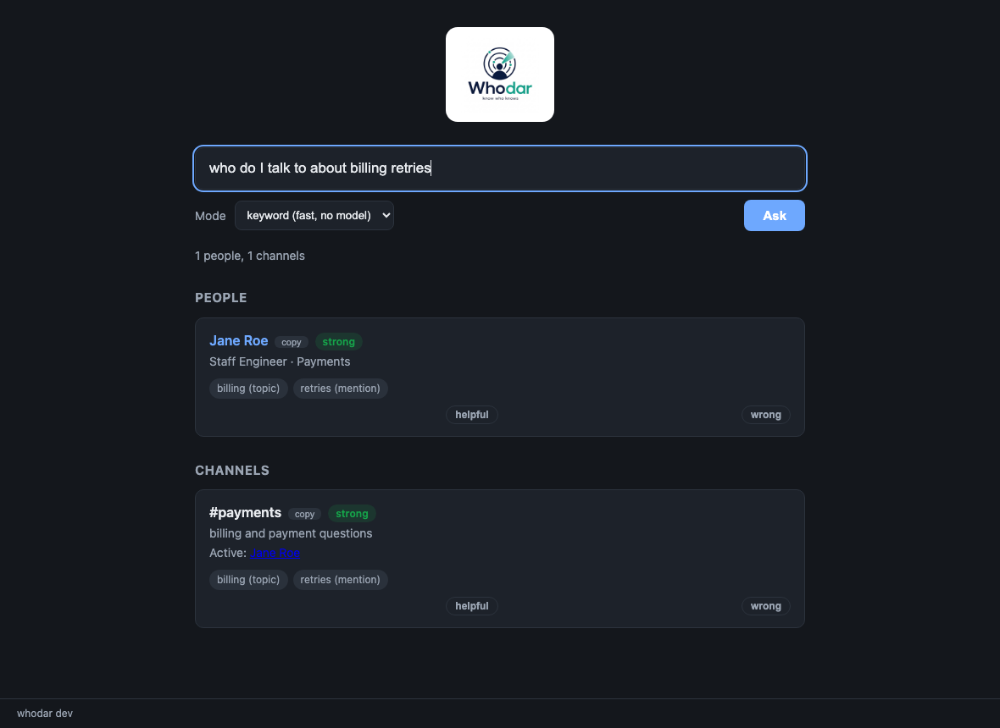

  

# whodar

  
  
  
  
  
  

whodar helps you find who to ask at work. Point it at the tools your org
already uses and ask a question in plain words. It returns the people to talk
to and the channels to ask in, with the reason and confidence behind each one.
It runs locally by default, with or without an LLM.

## See it

Ask from the terminal and get people, channels, reasons, and confidence:

  

Or serve the local web UI, where every result carries a confidence badge and
feedback buttons, a query lives in the URL so answers are shareable, and
clicking a person shows everything whodar knows about them:

  

## Install

    brew install dcadolph/whodar/whodar

Or `go install github.com/dcadolph/whodar@latest`, or grab a prebuilt binary
from the releases page.

## Quickstart

No data yet? Explore a simulated company across all eight sources, no
credentials needed:

    whodar demo

Then index something real:

    whodar index --source org-csv --file examples/people.csv
    whodar ask --pretty "who do I talk to about billing retries"

Then merge in the rest of your tools, one source at a time:
`slack`, `github`, `jira`, `confluence`, `pagerduty`, `git`, and `codeowners`.
Run `whodar index --help` or see [docs/REFERENCE.md](docs/REFERENCE.md) for
every source, flag, and credential.

## How it works

- Eight pluggable sources feed one graph of people, teams, topics, and
  channels. Adding a source is one small interface.
- One human stays one node: sources join by email, and an alias file joins
  handle-only identifiers like a GitHub login.
- Recent activity counts more, every answer carries a confidence, and results
  explain which words hit where.
- Answers learn: confirm or correct a result and future rankings move,
  without burying the evidence.
- Three query modes: keyword (no model, always works), semantic, and a local
  LLM through Ollama. The CLI, web UI, and Slack bot share one engine.

## Data governance

Indexed work data is sensitive, so whodar enforces where it can go. The
default policy is strict: nothing leaves the machine, and every external call
passes one policy checkpoint. Cloud models (Claude, OpenAI, or any compatible
server) exist behind explicit opt-in, and the redacted policy sends them only
anonymized numbered candidates, never names or emails. An organization can
pin the policy with a locked config that user flags cannot override.

## Docs

- [Getting started](docs/GETTING_STARTED.md): install, index each source, ask,
  serve, run the bot.
- [Reference](docs/REFERENCE.md): every command, flag, source, and
  environment variable.
- [Architecture](docs/ARCHITECTURE.md), [deploying](docs/DEPLOY.md),
  [roadmap](docs/ROADMAP.md), and [contributing](CONTRIBUTING.md).

## License

Licensed under the GNU Affero General Public License v3.0. See [LICENSE](LICENSE).
Copyright 2026 dcadolph.
